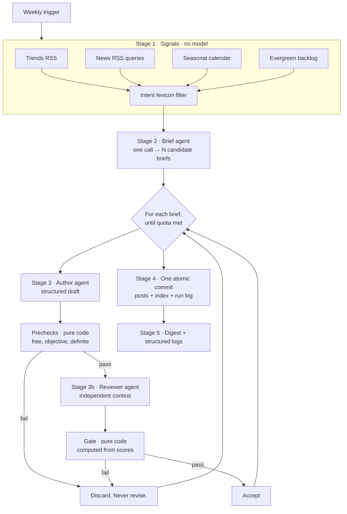

# Perennial

**A trend-fed, evergreen-out article engine.**
Build spec v1 · vendor-neutral · unattended

---

## 1. What this is

Perennial is an unattended content engine. Once a week it reads what the world
is searching for, decides what that implies about the problems your audience is
about to have, writes a small number of articles about those problems, judges
its own work, throws most of it away, and publishes what survives.

It is **not** a "write me 200 blog posts" tool. It is deliberately capped, it
discards more than it ships, and its output is designed to still be worth
reading in eighteen months.

You plug in one config file describing your site. The engine is otherwise
unchanged between deployments.

| | |
|---|---|
| **Cadence** | Weekly, 1–3 posts (configurable, capped) |
| **Human involvement** | None per-run; a PR to review if you want one |
| **Cost** | ~$0.30–$0.60 per run at 2026 mid-tier model prices |
| **Runtime** | 5–8 minutes |
| **Output** | Markdown + frontmatter, committed to your repo (or handed to an adapter) |
| **Failure mode** | Publishes nothing. Never publishes something bad. |

### What it is not

- Not a scraper or spinner. Nothing is rewritten from another page.
- Not a volume play. Three a week is the ceiling by design — see §12.
- Not hands-off forever. You write the config, and the config is the product.

---

## 2. The thesis

This is the only idea in the system. Everything else is plumbing around it.

Search trend data tells you **which population is in motion this week**. It does
not tell you what to write. If you write *about* the trend you lose: news sites
and forums own trend queries within hours, and your article is dead in three
months.

So the engine inverts it:

> **The trend selects the topic. The trend never appears in the title.**

A trend surfaces a group of people who are, right now, about to run into a
problem your site addresses. The article addresses **the problem**, phrased as
the durable query that person will type. The trend supplies timing and framing
and nothing else.

| Signal this week | ❌ Trend article | ✅ Durable article |
|---|---|---|
| "FAFSA deadline" spiking | *FAFSA 2027 Deadline: What to Know* | **How to Sign and Date a Verification Form Without Printing It** |
| Hurricane → insurance claims | *Filing After the Storm* | **How to Attach Photos to a Claim Form** |
| A competitor raises prices | *Acme Raises Prices Again* | **The Five Things People Actually Pay Acme For** |
| "back to school" seasonal | *Back to School Season Is Here* | **What to Check Before You Sign a School Device Agreement** |
| A framework ships v4 | *What's New in Framework v4* | **How to Tell Which Framework Version a Project Is On** |

Every article must pass the **18-Month Test**: still accurate and still useful
eighteen months from now, with no edits. If it fails, it is discarded. That
single rule is what stops a trend-fed pipeline from producing a graveyard.

---

## 3. Architecture



**Atomicity.** The run commits everything or nothing. A crash at draft five
loses the week and the trigger fires again next cycle. That is far simpler than
resumable state, and nothing partial ever reaches your repo.

**Two things are computed in code, never by a model:**

1. The **prechecks** (§7) — objective, free, and run before any reviewer call.
2. The **gate** (§9) — the publish decision, derived from the reviewer's scores.

A model asked for a final verdict drifts toward approval over time. A model
asked only to score and quote does not.

---

## 4. Plugging in your site

This is the whole integration surface. One file. Everything else is the engine.

```ts
// perennial.config.ts
import { defineSite } from "perennial";

export default defineSite({
  identity: { /* §4.1 — who you are */ },
  claims:   { /* §4.2 — what you may and may not say */ },
  audience: { /* §4.3 — who is reading */ },
  style:    { /* §4.4 — how it should read */ },
  taxonomy: { /* §4.5 — what kinds of article exist */ },
  signals:  { /* §4.6 — what to watch */ },
  backlog:  [ /* §4.7 — the floor */ ],
  output:   { /* §4.8 — where posts go */ },
  limits:   { /* §4.9 — caps */ },
});
```

### 4.1 Identity — the synopsis

The engine needs to know what your site *is* before it can decide what your
readers need. `kind` is the important field: it changes the default article
archetype and the register of the closing paragraph.

```ts
identity: {
  name: "actuallyfreepdfeditor",
  url: "https://actuallyfreepdfeditor.com",

  // Drives article archetype and CTA register. See the table below.
  kind: "tool",

  // Two or three sentences, written for a stranger. This is injected verbatim
  // into every prompt. Be concrete and be honest — vague synopses produce
  // vague articles.
  synopsis: `A free browser-based PDF editor. It opens a PDF entirely in the
    user's own browser, lets them add text, signatures, highlights and
    white-out, reorder and rotate pages, and download the result. There is no
    account, no upload, no watermark and no paid tier.`,

  // What a reader is trying to accomplish when they land on you. One line.
  jobToBeDone: "Finish something they have to do to a document, right now.",
}
```

| `kind` | Default archetype | CTA register | Claims risk |
|---|---|---|---|
| `tool` | Task walkthrough | "here is the step where this helps" | **High** — feature claims |
| `saas` | Problem diagnosis → workflow | "this is what the product automates" | **High** — feature claims |
| `ecommerce` | Buying decision / comparison | "this is the product that fits" | **High** — spec and stock claims |
| `services` | Diagnosis, when to call someone | "this is when it's worth outsourcing" | Medium — scope of work |
| `media` | Explainer | newsletter or related reading | Low — no product |
| `community` | How to participate | "here is where to join in" | Low |
| `internal` | Runbook / reference | link to the internal tool | Low |

If your site is several of these, pick the one that describes the page the
article should send people to. The `kind` is not a description of your company;
it is a description of the conversion you want.

### 4.2 Claims — the anti-hallucination layer

**This is the single highest-value field in the config.** It is injected into
the author prompt, injected independently into the reviewer prompt, and enforced
by a set-difference precheck. Three layers, because this is the one that costs
you trust when it goes wrong.

```ts
claims: {
  // Things the engine MAY assert. Each string is copied verbatim into articles'
  // `claimsReferenced` field and checked by exact set membership — so write
  // them as complete, quotable capabilities.
  permitted: [
    "add text anywhere on a page, with control over font, size, weight and colour",
    "draw a signature with a mouse, trackpad or finger",
    "upload a photo of a signature and place it",
    "highlight passages",
    "white-out a region so the content underneath is not visible in the export",
    "reorder, rotate, duplicate and delete pages",
    "download the edited PDF with no watermark",
  ],

  // Things the engine must NEVER imply, in any phrasing, including hedged ones.
  // This list is MATERIAL, not an obstacle — see the note below.
  forbidden: [
    "OCR scanned documents",
    "convert a PDF to Word, Excel or PowerPoint",
    "edit the text already in the original PDF",
    "fill interactive form fields as form data",
    "merge or split PDF files",
    "apply a cryptographic or certificate-based signature",
    "open or remove the password from a protected PDF",
  ],

  constraints: [
    "files up to 100 MB",
    "all processing happens in the browser; the file is never uploaded",
    "no account, no watermark, no trial",
  ],

  // Topics that require hedging rather than assertion. Any claim in these areas
  // caps the reviewer's factualSafety score, which the gate requires at 5.
  sensitive: ["legal", "tax", "medical", "immigration", "jurisdiction-specific"],
}
```

> **The `forbidden` list is content, not a constraint.** The author prompt
> instructs the model to *use* it: "this tool can't OCR a scan, here's what to
> reach for instead" is a genuinely useful paragraph and it is what makes the
> rest of the article credible. Articles that quietly avoid their own
> limitations read as marketing, and the reviewer is told to reject them.

**Keep this file honest.** It changes in the same commit as any feature change.
A stale manifest is worse than none, because three separate checks trust it.

For non-tool sites the same structure applies with different content:

```ts
// ecommerce
permitted: ["ships to the UK and EU within 3 working days",
            "offers a 60-day return window on unopened items"],
forbidden: ["ships to the US", "offers price matching", "sells refurbished units"],

// media
permitted: ["reports on the sector", "publishes a weekly newsletter"],
forbidden: ["gives individual financial advice",
            "recommends specific securities",
            "claims any regulatory registration"],
```

### 4.3 Audience

```ts
audience: {
  // Who they are, in their own terms — not marketing personas.
  description: `Someone who has been handed a document and needs to do
    something to it in the next ten minutes. Not a designer, not technical,
    often on a phone, frequently mildly annoyed.`,

  // What they already know. Prevents the author over-explaining.
  assumedKnowledge: "Can use a computer. Does not know what a content stream is.",

  // Where they are when they read this.
  context: "Mid-task, file already open, wants the answer not the background.",
}
```

### 4.4 Style — the prompting layer

This is your voice, expressed as rules a model and a reviewer can both check.
Everything here is injected into both prompts.

```ts
style: {
  voice: [
    "Second person, present tense. 'You', not 'users'.",
    "Open with the answer. No throat-clearing, no scene-setting.",
    "Prose paragraphs, not bullet spam. At most one short list per article.",
    "Concrete: name real tools, real numbers, real key combinations.",
    "Say when this is NOT the answer. Volunteer the limitation before the reader hits it.",
    "Em dashes are fine. Do not overdo it.",
  ],

  shape: {
    words: [500, 900],          // hard range, enforced by precheck
    sections: [4, 6],           // heading count, enforced
    headingWords: [2, 5],       // enforced
    headingsMayBeQuestions: false,
    maxBoldPhrases: 2,
    maxLists: 1,
  },

  // Case-insensitive substring match. Any hit is a definite reject, no model
  // judgement involved. Add to this list every time you notice a tic.
  bannedPhrases: [
    "in today's digital landscape", "in today's world", "delve", "leverage",
    "seamless", "robust", "unlock", "game-changer", "revolutionize",
    "navigate the complexities", "it's worth noting", "in conclusion",
    "in this article, we'll", "let's dive in", "look no further",
    "we've got you covered", "act now", "before it's too late",
  ],

  // Regex patterns for things a substring can't catch.
  bannedPatterns: [
    { label: "Whether you're a X or a Y", pattern: /\bwhether you(?:'re| are) an? \w+/i },
    { label: "sentence opening with Additionally,", pattern: /(?:^|[.!?]\s+)Additionally,/ },
    { label: "emoji", pattern: /[\u{1F300}-\u{1FAFF}]/u },
    { label: "exclamation mark", pattern: /!/ },
  ],

  cta: {
    // Exactly this many mentions of your domain in the whole article.
    mentions: 1,
    // Which named field it must live in. Enforced by precheck.
    field: "ctaParagraph",
    placement: "second-to-last paragraph",
    rules: [
      "Describes the product as a step in the reader's task, not as a pitch.",
      "No superlatives. Not 'the best', not 'the easiest'. State what it does.",
      "Never in the opening. Never in the first half.",
    ],
    // A worked example is worth more than five rules. Give the model one.
    exemplar: `Arkibber helps you search, filter, and evaluate items before you
      decide whether to grab them — so you spend less time downloading things
      you do not need.`,
  },
}
```

**On tuning this.** The banned list is where your voice actually lives. Start
with the defaults, read the first ten drafts, and add a phrase every time
something makes you wince. After about thirty entries the output stops sounding
generated.

### 4.5 Taxonomy — the kinds of article

```ts
taxonomy: {
  // Your article archetypes. Used for dedup, diversification, and to decide
  // which posts get HowTo structured data.
  intents: [
    { id: "how-to",          label: "How-to",         procedural: true },
    { id: "troubleshooting", label: "Troubleshooting", procedural: true },
    { id: "comparison",      label: "Comparisons",     procedural: false },
    { id: "explainer",       label: "Explainers",      procedural: false },
    { id: "buying-decision", label: "Buying guides",   procedural: false },
  ],

  // The engine tracks the last N weeks of intents and instructs the brief agent
  // to diversify away from them. Without this the corpus converges on one shape.
  diversifyOverWeeks: 12,
}
```

`procedural: true` is what earns an article `HowTo` structured data. Emitting
HowTo on a comparison piece claims a step sequence the page does not have, which
is a misrepresentation search engines are entitled to penalise.

### 4.6 Signals — what to watch

```ts
signals: {
  // 1. Trends RSS. Noisy — 90%+ is sport and celebrity. It is a lottery ticket,
  //    not the engine. The lexicon below is what makes it cheap to keep asking.
  trends: {
    enabled: true,
    geos: ["US", "GB", "CA", "AU"],
    // A trend survives only if one of these appears in its title OR in any of
    // its attached news snippets. The snippets are the useful part — a bare
    // trend title ("Chiefs vs Bills") carries no intent, but a snippet saying
    // "applications open" does.
    intentLexicon: [
      "form", "application", "apply", "deadline", "filing", "enroll", "rebate",
      "claim", "refund", "tax", "waiver", "permit", "licence", "renewal",
      "contract", "lease", "sign", "signature", "notarise", "submit",
      "paperwork", "document", "transcript", "visa", "passport", "pdf", "scan",
    ],
    cap: 20,
  },

  // 2. News RSS keyword search. The highest-value source, and deterministic.
  //    Hand-tuned over time. This is where most usable trend signal comes from.
  news: {
    enabled: true,
    queries: [
      '"PDF form" deadline',
      "e-signature law",
      "IRS form release",
      "open enrollment forms",
      "Acrobat subscription price",
    ],
    perQuery: 5,
  },

  // 3. Seasonal calendar. ISO week -> themes. This is what guarantees you ship
  //    when both feeds are dead. Gaps fall back to the nearest earlier week.
  seasonal: {
    1:  ["W-2 and 1099 arrival", "new-year contract renewals"],
    12: ["tax deadline approach", "extension forms"],
    30: ["back-to-school forms", "enrolment packets"],
    42: ["open enrollment", "benefits election forms"],
    48: ["year-end invoices", "expense reports"],
    // ...roughly 15-20 entries covers a year.
  },

  // Soft preference passed to the brief agent, not a hard rule.
  composition: { trend: 1, seasonal: 1, backlog: 1 },
}
```

> **Every live feed is optional by construction.** If both return nothing the
> run logs `SIGNAL_DEGRADED` and proceeds on the calendar and the backlog. A
> dead RSS feed must never cost you a week's posts.

### 4.7 Backlog — the floor

A ranked list of queries you already believe convert. Each entry is consumed
once and flagged in the same commit as the post it produced.

```ts
backlog: [
  { id: "bl-001", query: "how to sign a pdf without adobe",
    intent: "how-to", volume: "high", used: false },
  { id: "bl-002", query: "why can't i type in this pdf",
    intent: "troubleshooting", volume: "high", used: false },
  // ...seed 40-60. Refill when it drops below ~20.
]
```

**Most weeks, most posts come from here. That is correct behaviour, not
failure.** A backlog article beats a forced trend-to-task bridge every time, and
the brief agent is told so explicitly.

### 4.8 Output — where posts go

The engine is storage-agnostic. It produces `RenderedPost` objects and hands
them to an adapter.

```ts
interface OutputAdapter {
  /** Existing posts, for dedup. Fed to both agents. */
  readIndex(): Promise<PostIndexEntry[]>;
  /** Commit everything, atomically, or throw. */
  publish(batch: {
    posts: RenderedPost[];
    index: PostIndexEntry[];
    runLog: RunLog;
    consumedBacklogIds: string[];
  }): Promise<{ url?: string }>;
}
```

**Git adapter (reference implementation).** Writes through the GitHub Git Data
API: blobs → tree → one commit → ref. Works from any serverless function, which
cannot write to its own source. The push triggers your rebuild. In PR mode it
opens a pull request instead of moving the default branch.

*Why the repo is a good default store:* posts are reviewable in a PR before they
ship, run logs are diffable next to the output they produced, and rollback is
`git revert`.

**Other adapters** — implement the interface above:

| Target | `readIndex` | `publish` |
|---|---|---|
| **WordPress** | `GET /wp/v2/posts?_fields=slug,title` | `POST /wp/v2/posts` with `status: draft` |
| **Contentful / Sanity** | query the content type | create entries, publish as one transaction |
| **Postgres** | `SELECT slug, title, dek FROM posts` | one `INSERT ... ON CONFLICT` transaction |
| **Ghost** | Admin API `browse` | Admin API `add`, `status: draft` |
| **Local filesystem** | read the content dir | write files (for a static site built in CI) |

> Publishing as **draft** is the CMS equivalent of PR mode. Use it for the first
> month.

### 4.9 Limits

```ts
limits: {
  postsPerRun: 3,
  maxDraftsPerRun: 6,      // over-generate; the reviewer will reject some
  maxCostUsd: 2.00,        // checked after every model call; abort commits nothing
  authorModel: "claude-sonnet-5",
  reviewerModel: "claude-sonnet-5",   // a stronger model here is the upgrade worth paying for
}
```

---

## 5. Worked configs

Three sites that are nothing like each other, to show the shape transfers.

### 5.1 A B2B SaaS — incident management

```ts
identity: {
  kind: "saas",
  synopsis: `An on-call scheduling and incident response tool. Teams define
    rotations, route alerts from their monitoring stack, and run postmortems.
    Used by engineering teams of 5-200.`,
  jobToBeDone: "Stop being woken up for the wrong things.",
},
claims: {
  permitted: ["route alerts from Datadog, Prometheus and CloudWatch",
              "define follow-the-sun rotations across time zones",
              "escalate to a secondary responder after a configurable timeout"],
  forbidden: ["monitor infrastructure directly",
              "replace a status page",
              "provide SOC 2 attestation on the free plan"],
  sensitive: ["compliance", "SLA guarantees", "contractual uptime"],
},
taxonomy: { intents: [
  { id: "runbook",     label: "Runbooks",     procedural: true },
  { id: "postmortem",  label: "Postmortems",  procedural: false },
  { id: "comparison",  label: "Comparisons",  procedural: false },
  { id: "explainer",   label: "Explainers",   procedural: false },
]},
signals: {
  news: { queries: ["major cloud outage", "SRE hiring", "on-call burnout study",
                    "incident response postmortem"] },
  seasonal: { 47: ["holiday freeze planning", "skeleton-crew rotations"],
              1:  ["on-call rotation resets", "annual runbook review"] },
},
```

*Signal → article:* a large cloud provider has a visible outage this week →
**"How to Write an Escalation Policy That Survives a Regional Outage"**, not
"What Happened During the AWS Outage".

### 5.2 An ecommerce store — specialty coffee

```ts
identity: {
  kind: "ecommerce",
  synopsis: `A single-origin coffee roaster shipping within the UK and EU.
    Roasts to order twice weekly. Sells whole bean and ground, subscriptions
    and one-off bags, plus a small range of brewing equipment.`,
  jobToBeDone: "Buy coffee they'll actually enjoy, without becoming a hobbyist.",
},
claims: {
  permitted: ["roast to order twice a week",
              "ship to the UK and EU within 3 working days",
              "grind to order for a named brew method"],
  forbidden: ["ship to the United States",
              "sell decaf",
              "guarantee a specific origin is in stock",
              "offer same-day delivery"],
  sensitive: ["health claims about caffeine", "origin sustainability certification"],
},
taxonomy: { intents: [
  { id: "brewing-guide",   label: "Brewing",     procedural: true },
  { id: "buying-decision", label: "Buying",      procedural: false },
  { id: "explainer",       label: "Explainers",  procedural: false },
]},
signals: {
  seasonal: { 46: ["gifting season", "advent and sampler sets"],
              22: ["iced and cold brew", "warm-weather brewing"] },
  news: { queries: ["coffee price futures", "arabica harvest", "EU deforestation regulation coffee"] },
},
```

*Signal → article:* green coffee futures spike in the news →
**"Why Your Bag of Coffee Costs What It Costs"**, not "Coffee Prices Surge in
2027". The first is true forever; the second is wrong by spring.

### 5.3 A media site — local news

```ts
identity: {
  kind: "media",
  synopsis: `An independent newsroom covering one metropolitan area. Reports
    on local government, housing, transit and schools. Reader-funded, no
    paywall, weekly newsletter.`,
  jobToBeDone: "Understand something that affects where they live.",
},
claims: {
  permitted: ["publish a free weekly newsletter", "cover city council meetings"],
  forbidden: ["provide legal advice",
              "represent any political party",
              "claim any government affiliation"],
  sensitive: ["legal", "electoral", "ongoing criminal proceedings", "named individuals"],
},
style: {
  cta: { mentions: 1, field: "ctaParagraph",
         rules: ["Invite to the newsletter. Never a donation ask inside an article."] },
},
```

*Signal → article:* a transit strike is trending →
**"How to Find Out Which Bus Routes Your Council Actually Controls"**, not
"Day Three of the Transit Strike". The first is a civic reference that gets
linked for years.

---

## 6. Stage 2 — the brief agent

One call. Over-generates deliberately: you need `postsPerRun` survivors and the
reviewer will reject some.

**Input:** filtered trend items, news items, this week's seasonal themes, unused
backlog entries, the full existing-post index, the claims policy, recent intents.

**Output:** N briefs, schema-validated.

```ts
const Brief = z.object({
  slug:            z.string().regex(/^[a-z0-9]+(-[a-z0-9]+)*$/),
  workingTitle:    z.string().max(70),
  targetQuery:     z.string(),        // the literal thing someone types
  intent:          z.enum(TAXONOMY_IDS),
  signalOrigin:    z.enum(["trend", "news", "seasonal", "backlog"]),
  signalEvidence:  z.string(),        // the exact headline that triggered it
  whyNow:          z.string().max(200),
  eighteenMonthTest: z.string().min(40),  // must ARGUE it, not assert it
  ctaHook:         z.string(),        // which permitted claim the CTA hangs on
  sectionPlan:     z.array(z.object({ heading: z.string(), covers: z.string() })).min(4).max(6),
  honestLimitation: z.string().min(20),   // what this article will admit
});
```

Two fields do the heavy lifting:

- **`eighteenMonthTest`** — the model must argue survival in prose. Forcing the
  argument is what catches briefs that are secretly newsjacking.
- **`honestLimitation`** — a named place where you, or anything, is the wrong
  answer. Briefs without one produce marketing, and the reviewer rejects it
  downstream, so it is cheaper to require it here.

**Optional grounding pass.** Give the brief agent web search with a 2-search
budget and have it check the SERP before proposing. It kills briefs where the
results are wall-to-wall vendor pages, and catches details that have changed.

> **Run it as a separate call.** Search results carry citations, and citations
> cannot be combined with a constrained output format. Do the search call first,
> feed its notes into the structured brief call as plain text.

---

## 7. Stage 3 — the author, and the prechecks

The author returns **structured sections, not markdown**. A deterministic
serializer assembles the file. The model never writes frontmatter, the CTA link
markup, related-post links, or prev/next.

*This is why the engine cannot emit a broken internal link.* Related posts are
computed in code by tag overlap and recency.

```ts
const Draft = z.object({
  slug:  z.string(),
  title: z.string().max(70),
  dek:   z.string().min(80).max(220),
  tags:  z.array(z.string()).min(2).max(4),
  lede:  z.string(),                    // answers the question immediately
  sections: z.array(z.object({
    heading: z.string().max(45),
    body:    z.string(),
  })).min(4).max(6),
  practicalNotes:   z.string(),         // caveats and edge cases
  ctaParagraph:     z.string(),
  claimsReferenced: z.array(z.string()),  // must ⊆ claims.permitted
});
```

### The prechecks

Pure code. Free, objective, and definite. They run **before any reviewer call**,
because spending money to discover an article is 1,400 words is waste.

| Check | Rejects when |
|---|---|
| `WORD_COUNT` | outside `style.shape.words` |
| `CLAIM_SET` | `claimsReferenced ⊄ claims.permitted` (set difference) |
| `CTA_COUNT` | domain appears ≠ `style.cta.mentions` times |
| `CTA_PLACEMENT` | the mention is outside `ctaParagraph` |
| `BANNED_PHRASE` | any `bannedPhrases` substring or `bannedPatterns` match |
| `SLUG_COLLISION` | slug already in the index |
| `TITLE_YEAR` | title contains a four-digit year |
| `HEADING_SHAPE` | heading outside `headingWords`, or is a question |

`TITLE_YEAR` deserves its place: a year in the title is the single clearest
signal that an article is pinned to a moment rather than to a problem.

---

## 8. Stage 3b — the reviewer

**Independence is the entire point, so enforce it structurally.**

```ts
// The signature is the enforcement. There is no parameter for the brief,
// the signal, or the author's reasoning — so the reviewer cannot be anchored
// by them, even accidentally.
function reviewArticle(input: {
  renderedArticle: string;   // the finished markdown, and nothing else
  claims: ClaimsPolicy;
  style: StyleContract;
  index: PostIndexEntry[];
}): Promise<Review>;
```

| Reviewer **receives** | Reviewer **never receives** |
|---|---|
| the rendered article | the brief |
| the claims policy | the author's rationale or `whyNow` |
| the style contract | the trend or news signal |
| existing post titles + deks | any prior review |
| the rubric | the fact that the author was a model |

An anchored reviewer rubber-stamps. That is the failure you are guarding
against, and a fresh `messages` array is not sufficient on its own — the fix is
that the information is not in scope to pass.

```ts
const Review = z.object({
  scores: z.object({
    taskUtility:     z.number().int().min(1).max(5),
    relevance:       z.number().int().min(1).max(5),
    factualSafety:   z.number().int().min(1).max(5),
    originality:     z.number().int().min(1).max(5),
    styleCompliance: z.number().int().min(1).max(5),
    evergreen:       z.number().int().min(1).max(5),
  }),
  violations: z.array(z.object({
    code: z.enum(["CLAIM_VIOLATION", "OFF_TOPIC", "NO_STANDALONE_UTILITY",
                  "DUPLICATE", "FACTUAL_RISK", "NEWSJACK", "CTA_ABUSE",
                  "STYLE_VIOLATION", "THIN"]),
    severity: z.enum(["blocker", "warning"]),
    detail:   z.string(),
    quote:    z.string(),   // the offending span, verbatim
  })),
  oneLineVerdict: z.string(),
});
```

Requiring a verbatim `quote` is what keeps violations actionable. A violation
without one is noise, and the run log is where you will read these later.

---

## 9. The gate

```ts
const THRESHOLDS = {
  taskUtility: 4, relevance: 4, factualSafety: 5,
  evergreen: 4, originality: 3, styleCompliance: 3,
};

function gate(review: Review): { passes: boolean; reasons: string[] } {
  const reasons = [
    ...review.violations.filter(v => v.severity === "blocker")
                        .map(v => `${v.code}: ${v.detail}`),
    ...Object.entries(THRESHOLDS)
             .filter(([dim, min]) => review.scores[dim] < min)
             .map(([dim, min]) => `${dim} scored ${review.scores[dim]}, needs ${min}`),
  ];
  return { passes: reasons.length === 0, reasons };
}
```

**`factualSafety` must be an absolute 5.** Deliberately not `>= 4`. A 4 means the
reviewer saw something, and anything touching law, tax, health or money is where
an unattended pipeline does real damage.

**On failure: discard. Do not revise.** Revision loops are how a pipeline talks
itself into publishing what the reviewer already rejected. Move to the next
brief. Shipping two posts this week is a fine outcome; shipping a bad third is
not.

---

## 10. Logging

Three layers. The first is the one that matters.

**Layer 1 — the run log is committed next to the posts.** Git history *is* the
audit trail. Every week's decisions are permanently diffable against the output
they produced.

```json
{
  "runId": "2027-W35",
  "durationMs": 341882,
  "signals": { "trendsFetched": 84, "trendsSurvivedFilter": 6,
               "newsFetched": 50, "degraded": false },
  "drafts": [
    { "slug": "remove-a-page-without-acrobat", "outcome": "PUBLISHED",
      "scores": { "taskUtility": 5, "factualSafety": 5, "evergreen": 5 },
      "wordCount": 742, "costUsd": 0.061 },
    { "slug": "convert-pdf-to-word", "outcome": "DISCARDED_REVIEW",
      "blockers": [{ "code": "CLAIM_VIOLATION",
                     "quote": "drop it in and export as .docx" }],
      "costUsd": 0.058 }
  ],
  "totalCostUsd": 0.44,
  "status": "OK"
}
```

Outcomes: `PUBLISHED` · `DISCARDED_PRECHECK` · `DISCARDED_REVIEW` ·
`DISCARDED_SCHEMA` · `SKIPPED_QUOTA_MET`.

**Layer 2 — an ops dashboard.** Reads the run logs, renders a table: week,
published titles, discarded titles with reason codes, cost, duration, cumulative
count. Ten minutes to build; it is the thing you will actually look at.

**Layer 3 — a webhook digest** to Slack or Discord at end of run.

```
Week 2027-W35 · published 3 / 5 drafts · $0.44
PUBLISHED
 • How to Remove a Page Without Acrobat          [backlog]
 • Why You Can't Type in That Benefits PDF       [seasonal]
 • How to Sign a Permission Slip on Your Phone   [trend: back-to-school]
DISCARDED
 • How to Convert a PDF to Word     CLAIM_VIOLATION
 • The 2027 FAFSA Deadline Guide    PRECHECK_TITLE_YEAR
```

Also emit one structured line per decision with a stable `evt` field
(`brief`, `draft`, `review`, `commit`) so log search works without a drain.

---

## 11. Cost and runtime

At mid-tier model pricing (~$3/MTok in, ~$15/MTok out):

| Call | In | Out | Cost |
|---|---|---|---|
| Brief agent ×1 | ~18k | ~3k | $0.10 |
| Author ×5–6 | ~10k ea | ~2.5k ea | ~$0.40 |
| Reviewer ×5–6 | ~7k ea | ~0.8k ea | ~$0.20 |
| **Per run** | | | **~$0.70** |
| **Per year** | | | **~$36** |

Two levers:

- **Prompt-cache the stable prefix.** The claims policy, style contract and post
  index are byte-identical across all author calls in a run. Cache-mark that
  block and the six author calls read it instead of re-paying: roughly 30% off.
- **A stronger reviewer** costs about 2.5× on a small slice of spend. It is the
  upgrade worth buying.

**Runtime** is 5–8 minutes. On platforms with a short function timeout this will
not fit in one invocation — run it in CI (GitHub Actions or equivalent) instead,
which has no meaningful limit, native repo write access, and better logs. Same
code, different trigger.

---

## 12. Failure modes

| Risk | Mitigation |
|---|---|
| Reviewer drifts lenient over time | Gate computed in code from scores, never from a model verdict field. Keep known-bad fixtures and assert the prechecks catch all of them in CI. |
| Corpus converges on one topic | Track intent distribution in the run log; feed the last 12 weeks to the brief agent and instruct diversification. |
| A feed 404s or changes shape | Feeds are optional by construction. Log `SIGNAL_DEGRADED`, fall through to seasonal + backlog. |
| An article claims something untrue | Three independent layers: claims policy in the author prompt, set-difference precheck, reviewer `CLAIM_VIOLATION` blocker. |
| **Search engines classify it as scaled content abuse** | **The real risk.** The 18-Month Test, the honest-limitation requirement, discard-don't-revise, and a hard cap of ~3/week are all aimed at this. Do not raise the cap. Publish something hand-written every few weeks. |
| Runaway cost | `maxCostUsd` checked after every call; abort commits nothing. |
| Duplicate posts months apart | Full index in both prompts, `DUPLICATE` blocker, slug-collision precheck. |
| Legal/tax content as advice | `factualSafety === 5` required; style contract mandates "check with the issuing body" phrasing for anything jurisdictional. |

---

## 13. Build order

Do these in order. Each step is useful on its own, and the discipline is that
**you do not automate step N until step N−1 reads well.**

1. **Static renderer first.** Markdown → routes, metadata, structured data,
   related posts, sitemap, feed. Hand-write two posts. Ship it. You now have a
   blog and everything downstream is optional.
2. **Write the config.** Identity, claims, style, taxonomy, backlog. This is a
   writing task, not a coding task, and it determines output quality more than
   any prompt will.
3. **Author + reviewer, offline.** A `draft --brief <file>` script. Hand it ten
   briefs. Read all ten. Tune until you would publish seven without edits.
   **Do not automate before this feels right.** Automating a mediocre author
   produces mediocre articles faster.
4. **Signals + brief agent.** Run standalone. Eyeball the briefs for a couple of
   weeks before wiring them to anything.
5. **Output adapter + trigger, in review mode.** PR or CMS-draft. Four weeks of
   reading what it produces. This is where you find out what your prompts
   actually do.
6. **Logging, dashboard, digest.** Then, and only then, flip to unattended.

### Launch checklist

- [ ] `claims.forbidden` is complete and honest, and someone who knows the
      product has read it
- [ ] `bannedPhrases` has been extended past the defaults with your own tics
- [ ] Backlog seeded with 40+ entries
- [ ] Seasonal calendar covers the next two quarters
- [ ] Trigger endpoint verified to **fail closed** without its secret
- [ ] Cost cap set below what you would be annoyed to lose
- [ ] Review mode on (`autoMerge: false` / CMS draft)
- [ ] Known-bad fixtures asserted in CI
- [ ] A human is subscribed to the digest

---

## 14. The quality bar

Five briefs a well-configured engine should produce, as calibration. The trend is
invisible in all five, and every title is a query:

1. **How to Sign a PDF on Your Phone Without an App** — admits a photo of a
   signature beats drawing on a small screen.
2. **Why You Can't Type in That Form** — explains flat scan vs. real form fields
   vs. locked; admits an overlay editor is a workaround, not field-filling.
3. **The Five Things People Pay Acrobat For** — names the two of five that
   genuinely need Acrobat.
4. **How to Black Out Information (and What Redaction Really Means)** — the
   honest one: covering is not deleting, and here is when that matters legally.
5. **How to Reorder Pages in a Scanned Document** — admits it cannot OCR, points
   at what can.

Every one of them tells the reader something against interest. That is not a
stylistic preference — it is the mechanism by which the rest of the article
becomes believable, and it is the single thing most content pipelines get wrong.
